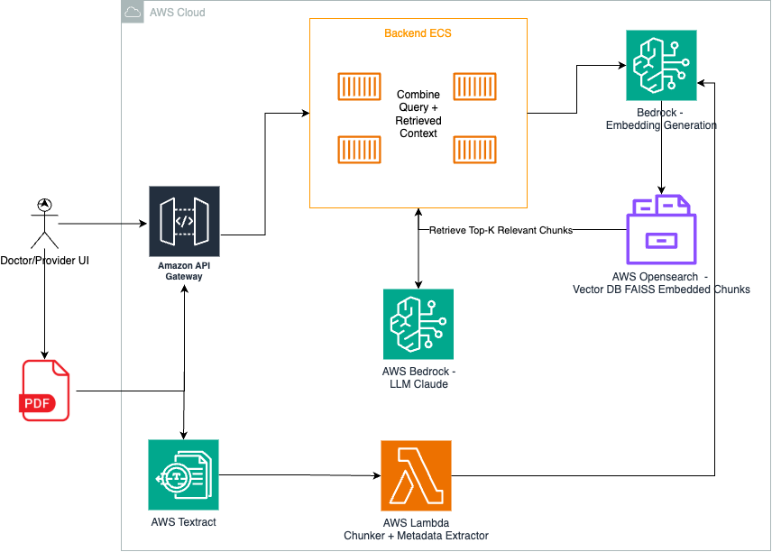

# 🏥 Healthcare EHR Chatbot using RAG on AWS

This project demonstrates a **Retrieval-Augmented Generation (RAG)** system built to allow healthcare providers to interact with scanned patient records (PDFs) using natural language questions.

## 📌 Use Case

Doctors and healthcare providers often need to retrieve specific information — such as past diagnoses, medication history, or allergies — from large and unstructured patient documents. These documents are typically uploaded as scanned PDFs in EHR systems.

This project uses **RAG** to enable providers to ask conversational queries and receive context-rich, accurate answers powered by LLMs and document retrieval.

---

## 🧠 How It Works

1. **Scanned PDF Upload**: Patient records are uploaded to the EHR system as scanned PDFs.
2. **Text Extraction (OCR)**: Amazon Textract converts scanned PDFs into raw text.
3. **Chunking + Metadata Extraction**: An AWS Lambda function breaks the text into logical chunks and extracts metadata (e.g., patient ID, section headers).
4. **Embeddings Generation**: Amazon Bedrock generates vector embeddings from the chunks.
5. **Vector Storage**: Chunks are stored in a Vector DB (e.g., Amazon OpenSearch or FAISS).
6. **Provider Query**: A doctor queries the system via an EHR-integrated chat UI (via API Gateway).
7. **Backend ECS Service**:
    - Embeds the user query using Bedrock.
    - Retrieves top-k relevant chunks from the vector DB.
    - Assembles the prompt with context.
8. **Answer Generation**: Bedrock (Claude/GPT) generates a grounded response.
9. **Response Delivery**: The result is returned to the doctor via the UI.

---

## 📐 Architecture Diagram

📎 The full system architecture is illustrated in this diagram:

---

## 🔐 Security & HIPAA Compliance

This system is designed with security and compliance in mind:

- ✅ Uses **HIPAA-eligible AWS services** (Textract, S3, Bedrock, Lambda, ECS)
- ✅ Data encrypted in transit (TLS) and at rest (S3 with KMS)
- ✅ Secure access control using AWS IAM
- ✅ Network-level protections via VPCs, private subnets, and endpoint policies
- ✅ Logging and auditing via CloudTrail and CloudWatch

---

## 🧰 Services & Technologies Used

| Component                   | AWS Service Used                         |
|----------------------------|------------------------------------------|
| File Upload                | Amazon S3                                 |
| OCR Processing             | Amazon Textract                           |
| Text Chunking              | AWS Lambda                                |
| Embedding Generation       | Amazon Bedrock                            |
| Vector Storage             | Amazon OpenSearch / FAISS                 |
| Query Embedding & Retrieval| Amazon ECS + Bedrock                      |
| Prompt Assembly & Orchestration | Amazon ECS                         |
| LLM Inference              | Amazon Bedrock (Claude / Titan / GPT)     |
| Chat UI & APIs             | Amazon API Gateway                        |
| Security Controls          | IAM, KMS, VPC, CloudTrail                 |

---

